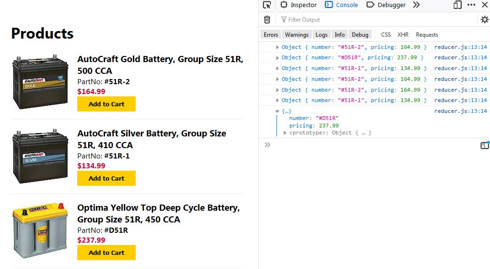

This project was bootstrapped with [Create React App](https://github.com/facebook/create-react-app).

## React Product Page with Redux State

You can view the [published site here](https://dcoco1890.github.io/react-test/)

State is handled by redux. The store is created by calling createStore with the reducer and loading a JSON file of products as the default/initial state. The reducer listens for an action called LOG_PART_INFO and makes a console log when it's fired. 

### Local

#### `yarn`

You can also clone this repo and run it locally. Start by navigating to your newly cloned directory and just running yarn. This will download all the dependencies needed

#### `yarn start`

Once yarn has finished, run yarn start. This should open a new tab in your preferred browser on localhost:3000. From there you can make changes to the code with your favorite code editor and see them change in real time. If it doesn't open a tab just navigate to [http://localhost:3000](http://localhost:3000) on your own.

